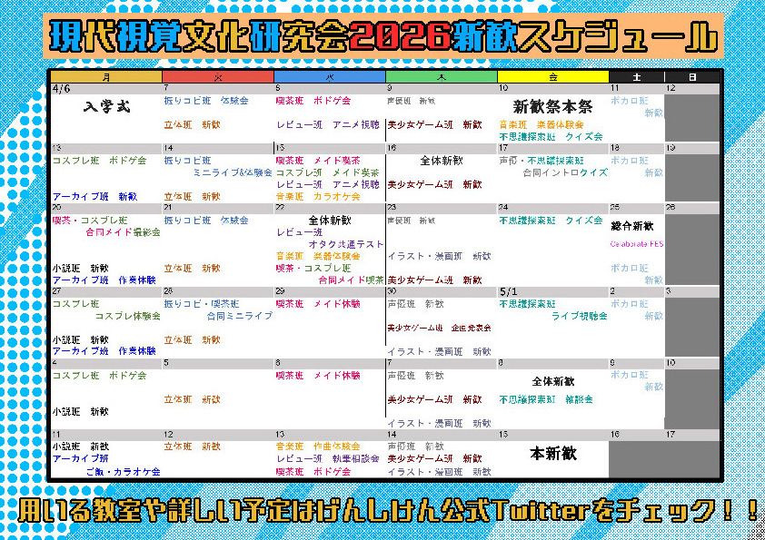

# 新歓のお知らせ

2026年現在のげんしけん全体の予定は下の写真のようになってるよ。

美少女ゲーム制作班は木曜日にやってるので木曜日に来てね!!!

(https://x.com/gsk_shinkan/status/2038848823603425384?s=20)

美少女ゲーム制作班の新歓用のtwitterも確認してね!!!

[twitter](https://x.com/gsk_bishojo)

 

 
 
 
 
 
 
 
 
 
 
 
 
 
 
 
 
 
 

ということで現時点ではこれぐらいしか決まっていないのでここからは自分の美少女ゲームの思い出でも喋ろうと思います。

## ノラと王女と野良猫ハート

僕が美少女ゲームと出会ったのはノラと王女と野良猫ハートのアニメでした。当時小学ウン年生だった自分は中学入試というやつの勉強をしていました。その中での数少ない楽しみは塾から家に帰った後深夜アニメを見ることでした。ということで見ていたのがノラととのアニメなわけですね。アニメなのに思いっきり実写でヤギを出したり、オープニングでマジモンの太平洋を出すような表現は今思えば陳腐なのかもしれませんが小ガキの自分にはぶっ刺さってしまったわけです。

当時は†原作†を気にするみたいな高度な技術は持ち合わせてなかったので意識していませんでしたが後からエロゲ原作と知っていつか原作をやりたいなあということをぼんやり思うようになったのが美少女ゲーム人生の始まりでした。
それからpcを手に入れて、ソフトを買う資金を手に入れて、とやるまでに幾千もの時間がかかってしまったためか、それとも最初にやった美少女ゲームだからなのかはわかりませんが未だに一番好きなゲームだと思います。
好き、というのは単に面白いとかではなくプレイするまでの苦労とか、初めてのものを触るワクワクとかも含めて好きなんだと思います。

ところで3はいつ出るのでしょうか....?

## 月姫R

月姫Rを知った当時のことはよく覚えていて、fgoをやり始めて半年ぐらい、型月の生放送で月姫Rが発表されたときです。この解禁映像に一目惚れしてこれはもうやらなければ、みたいな使命感すら感じたのを覚えています。

全体の演出が非常に寝られていて映像でも文章でも表現できないノベルーゲーム特有の良さや威力などを実感した作品でもあります。これを吉里吉里ベースで作ってるってマジ？
また自分が型月の世界観が好きだとかアルクェイドの人格が好きだとかそういうのを抜きにしてもアルクルートは一緒にいて楽しいから好きだという根本的な感情を最も美しく描いている作品だと思います。

ところで(ry

## WHITE ALBUM2

これは結構最近やりました。SNSでこのゲームの話をしている人がいていいな～って思ってやりました。幼稚園生でしょうか。

このゲームはとにかく苦しい時間が長かったです。つまらない、ではなく苦しい時間でした。
ものすごく不愉快なキャラクターの喋るシーンが非常にしんどかったです。誰とはいいませんけど。
それとは別に春希のあり方が見ていて非常につらかったです。こう、人を助けることで自分の状況がどうにもならないことから逃避していることとか、自分の好きな子に近づかずにはいられないところとか、つれ～って感じでした。だからこそかずさTrueで真の意味で春希が幸せになれた、という感動が深くて良かったですね。まだ記憶になりきっていないので断言はできませんが冬馬かずさは一番好きなヒロインかもしれません。

「美少女ゲーム」はそれなりに人を選ぶ作品が多いと思うんですがその中ではかなり万人が楽しめて、感動できる稀有なゲームだと思います。勿論かなり長いプレイ時間を許容できるなら、という但し書きはつきますが。
